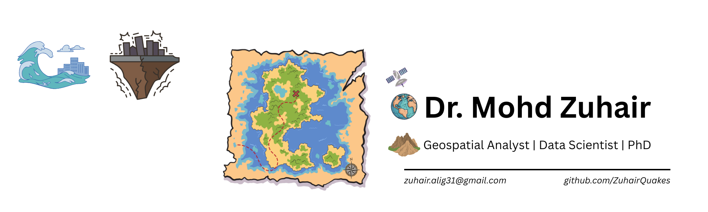

# Greetings! I am Mohd Zuhair... 👋

Welcome to my GitHub Profile!

## 🚀 About Me

I love developing geospatial solutions for complex environmental problems. I hold a PhD from a top-tier university and over 8 years of experience transforming complex environmental and geospatial data into actionable insights. Proven expertise in leveraging Python, SQL, GIS (QGIS/ArcGIS Pro), FME, and Machine Learning (including Deep Learning & XAI) to develop robust data pipelines, automate workflows, and build predictive models for multi-hazard risk assessment (earthquakes, tsunamis) and environmental monitoring. Expertise in remote sensing and geodetic datasets to understand complex Earth systems and inform decision-making for urban resilience and coastal defence.

### I specialize in:
1. Geospatial Analytics
2. GIS & Cartography
3. Data Science and Machine Learning

## 🔧 Featured Projects

| Project | Description | Tech Stack |
|---------|-------------|------------|
| [**Geospatial-Analysis**](https://github.com/ZuhairQuakes/StrainSeis-Correlation) | Geospatial workflow to automate environmental risk assessment |      
| [**Coastal-Risk-Mapping**](https://github.com/ZuhairQuakes/Coastal-hazard-mapping) | Coastal hazard and tsunami risk mapping |   
| [**ML-Framework**](https://github.com/ZuhairQuakes/AI-Fault-Classification) | ML for identifying factors responsible for large earthquakes  |      
| [**GNSS/GPS**](https://github.com/ZuhairQuakes/InSAR-GPS-StrainCalc/tree/main) | A Python tool to map seismic risk using geodetic data |     
| [**High-Performance-Computing**](https://github.com/ZuhairQuakes/GeoModel-HPC) | HPC for understanding big earthquakes |   

## 🔗 Links

